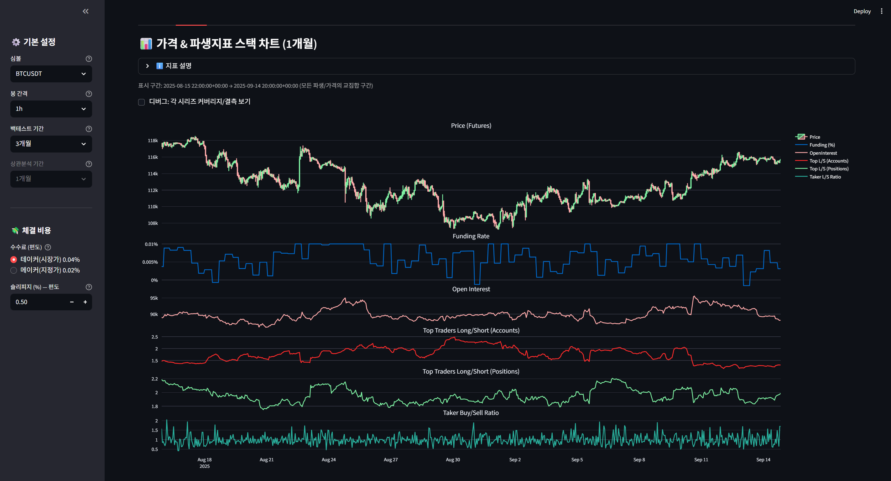

# 📊 IndicLens
**커스텀 백테스트 · 파생지표 상관분석 대시보드**

IndicLens는 코인 시장에서 많이 쓰이는 **기술적 지표를 조합하여 커스텀 전략을 생성·백테스트**하고,  
바이낸스 파생 지표(Funding, Open Interest, 롱/숏 비율, Taker Volume)와  
가격 수익률 간의 **상관관계 및 시차 상관**을 분석할 수 있는 데이터 분석 프로젝트입니다.  

---

## 👀 미리보기
<p align="center">
  
</p>

---

## 🚀 주요 기능
- **커스텀 백테스트**
  - SMA/EMA/RSI/MACD/Bollinger Bands 기반 **커스텀 룰 조합 전략** 백테스트
  - 성과 지표: 총수익률, CAGR, MDD, Sharpe, 승률
- **파생지표 상관분석**
  - Funding Rate / OI / Global Long-Short / Top Traders Long-Short / Taker Volume
  - Pearson/Spearman 상관계수 및 시차(lead/lag) 상관 분석
- **대시보드**
  - Streamlit 기반 인터랙티브 UI
  - 2개 주요 탭: **백테스트 · 파생지표 상관분석**

---

## 🛠️ 기술 스택
- **언어/런타임**: Python 3.13+  
- **데이터 수집**: `requests`  
- **데이터 분석**: `pandas`, `numpy`, `scipy`  
- **시각화/대시보드**: `streamlit`, `matplotlib`, `seaborn`  
- **개발 도구**: PyCharm, Git/GitHub  
- **운영 환경**: Streamlit Cloud (GitHub 연동 배포)  

---

## 📂 프로젝트 구조
```
IndicLens/
├─ app.py                   # Streamlit 메인 앱
├─ backtest/                # 데이터 수집, 지표 계산, 백테스트 로직
│ ├─ init.py                # 패키지 마커 + 편의 import
│ ├─ data.py                # Binance 데이터 수집
│ ├─ indicators.py          # SMA/EMA/RSI/MACD/BB 지표 계산
│ ├─ signals.py             # 지표 기반 매수/청산 시그널 생성
│ ├─ engine.py              # 백테스트 엔진 (롱 온리 전략)
│ ├─ evals.py               # 성과 지표 계산 (CAGR, MDD 등)
│ └─ correlation.py         # 파생지표 vs 가격 상관/시차 분석
├─ scripts/                 # 테스트/유틸 스크립트
│ └─ smoke_fetch.py         # Binance 데이터 수집 테스트
├─ data/                    # CSV 캐시 (gitignore 대상)
│ └─ .gitkeep               # 빈 폴더 유지용
├─ docs/                    # 기획서/명세서/계획 문서
│ └─ images/preview.png     # 대시보드 스크린샷
├─ .gitignore               # 불필요 파일/폴더 제외 설정
├─ requirements.txt         # 패키지 의존성
└─ README.md                # 프로젝트 소개 문서
```

---

## ⚡ 실행 방법

### 1. 클론 & 환경 세팅
```bash
git clone https://github.com/<your-username>/IndicLens.git
cd IndicLens
python -m venv .venv
source .venv/bin/activate   # Windows: .venv\Scripts\activate
pip install -r requirements.txt
```

### 2. Streamlit 실행
```
streamlit run app.py
```

### 3. 브라우저 확인

기본 URL: http://localhost:8501
